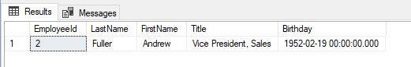

### 1.Create a view named “view_product_order_[your_last_name]”, list all products and total ordered quantity for that product.
```
Create View view_product_order_He as 
(select p.ProductName, Sum(od2.Quantity) as 'Total ordered quantity'
from Products p join
(
Select od.Quantity, od.ProductID
from Orders o join [Order Details] od
on o.OrderID = od.OrderID
) od2 
on od2.ProductID = p.ProductID
group by p.ProductName
)

--------------- OR ---------------------

Create View view_product_order_He1 as (
select p.ProductName, SUM(od.Quantity) as 'Total ordered quantity'
from Orders o join [Order Details] od
on o.OrderID = od.OrderID
join Products p on p.ProductID = od.ProductID
group by p.ProductName
)
```

### 2.Create a stored procedure “sp_product_order_quantity_[your_last_name]” that accept product id as an input and total quantities of order as output parameter.
```
Create Proc sp_product_order_quantity_He2
@id int,
@total int out
As 
Begin
	select @id = view_product_order_He_ID.ProductID
	, @total = view_product_order_He_ID.[Total ordered quantity]
	from view_product_order_He_ID
	where ProductID = @id
	return;
End
Declare @something  int
exec sp_product_order_quantity_He2 23, @total = @something OutPut;
print @something
```

### 3. Create a stored procedure “sp_product_order_city_[your_last_name]” that accept product name as an input and top 5 cities that ordered most that product combined with the total quantity of that product ordered from that city as output.
```
-- productName| ShipCity| TotalOrdered | Rank od city sales
--Alice Mutton	Boise	204	1
--Alice Mutton	Graz	121	2
--Alice Mutton	Albuquerque	73	3
--Alice Mutton	Montréal	70	4
--Alice Mutton	Salzburg	70	4
--Alice Mutton	Seattle	62	5
Create Proc sp_product_order_city_He
@a varchar(15)
As 
Begin
	Select top 5 *, dense_RANK() over(Partition by ProductName
	Order by [Total Ordered] desc) as 'Rank of city sales'
	from (
	Select p.ProductName , o.ShipCity, 
	Sum(od.Quantity) as [Total Ordered]
	from Orders o join [Order Details] od
	on o.OrderID = od.OrderID join Products p
	on od.ProductID = p.ProductID
	group by p.ProductName, o.ShipCity) as [ProductCityQuantity]
	where @a = ProductName
End

Exec sp_product_order_city_He 'Alice Mutton'
```

### 4.Create 2 new tables “people_your_last_name” “city_your_last_name”. City table has two records: {Id:1, City: Seattle}, {Id:2, City: Green Bay}. People has three records: {id:1, Name: Aaron Rodgers, City: 2}, {id:2, Name: Russell Wilson, City:1}, {Id: 3, Name: Jody Nelson, City:2}. Remove city of Seattle. If there was anyone from Seattle, put them into a new city “Madison”. Create a view “Packers_your_name” lists all people from Green Bay. If any error occurred, no changes should be made to DB. (after test) Drop both tables and view.
```
create Table city_your_He(
Id int unique,
City varchar(15)
);
Insert into city_your_He(Id, City)
Values
(1, 'Seattle'), (2, 'Green Bay');

create Table people_your_He(
Id int unique,
Name varchar(30),
City int,
Foreign Key (City) references city_your_He(Id)
);
Insert into people_your_He(Id, Name, City)
Values
(1, 'Aaron Rodgers',  2), (2, 'Russell Wilson', 1), (3, 'Jody Nelson', 2);

Select * from city_your_He
Select * from people_your_He

Update city_your_He
Set City = 'Madison'
where City = 'Seattle'

Create View Packers_He as (
select p.Name as 'People Name', c.City 
from people_your_He p join city_your_He c
on p.City = c.Id
Where c.City = 'Green Bay'
)

Select * from Packers_He

Drop table people_your_He
Drop table city_your_He
Drop view Packers_He
```

### 5. Create a stored procedure “sp_birthday_employees_[you_last_name]” that creates a new table “birthday_employees_your_last_name” and fill it with all employees that have a birthday on Feb. (Make a screen shot) drop the table. Employee table should not be affected.
```
Create Proc sp_birthday_employees_He
As 
Begin
	create Table birthday_employees_your_He(
	EmployeeId int unique,
	LastName varchar(30),
	FirstName varchar(30),
	Title varchar(30),
	Birthday datetime
	);
	Insert Into birthday_employees_your_He 
	(EmployeeId, LastName, FirstName, Title, Birthday)
	Select EmployeeID, LastName, FirstName, Title, BirthDate 
	From Employees
	Where Month(BirthDate) = 2
End
--Drop proc sp_birthday_employees_He

Exec sp_birthday_employees_He
Select * from birthday_employees_your_He
Drop table birthday_employees_your_He
```


### 6. How do you make sure two tables have the same data?
```
-- When we do union. that will take out all the duplicate from the table. 
-- This will result the Unique part of A or B
Select * from A
Union 
Select * from B
Except
Select * from A
Intersect 
Select * from B 
```

