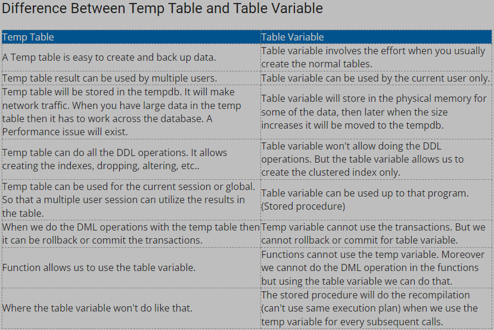

```diff
+ Green
- Red
! Orange
@@ Pink @@
# Gray
```

1. What is index; types of indices; pros and cons

```diff
+ One of the best ways to reduce disk I/O(Input/Output) is to use an index
Used to: 
    - Quickly find data in the WHERE clause.
    - Find matching rows in JOIN clause
    - Maintain quniqueness of key columns during INSERT & UPDATE
    - Sort, Aggregate and Group data. 

@@ Clustered Index && Non-Clustered Index @@
! Clustered Index: 
    - a way to represented base data as a whole.
        - Data rows are sorted
        - Data is stored at the leaf level
    - Primary key as default
- CON
    - Can't use filter, bacause it contains the base data in the table.
    - A clustered index creates lots of constant page splits, which includes data page as well as index pages.
- PRO
    - An ideal option for range or group by with MAX, MIN, COUNT type Queries

! Non-Clustered Index: 
    - a physically separate structure that reference the base data and it can have different sorted order.
        - Data rows are not sorted (Because it doesn't change the base data)
        - INCLUDE stored at leaf level
    - Uses Cluster ket or RID of a heap.
- CON
    - Have to use INCLUDE clause to get non-key value
    - Lookup process becomes costly
    - Every time the clustering key is updated, a corresponding update is required on the non-clustered index as it stores the clustering key.

- PRO
    - A table may have multiple non-clustered indexed in RDBMS.

Disadvantage of Index: 
    - Additional Disk Space
    - Insert, Update, Delete Statement become slow 
```

2. What's the difference between Primary key and Unique constraint?
```diff
! Primary Key:
    - Unqiue field on table, can't be null.
    - Other table can use this field to create foreign key relationships to themselves.
    - Create the cluster index automatically.
    - Only 1 primary key in a table.

! Unique Contraint:
    - A particular field must be unique.
    - Allows multiple Unqiue contraint in a table.
```

3. Tell me about check constraint
- Used to Limit the value range that can be placed in a column.
```
--Example:
    CREATE TABLE Persons (
    ID int NOT NULL,
    LastName varchar(255) NOT NULL,
    FirstName varchar(255),
    Age int,
    CHECK (Age>=18));
```

4. Difference between temp table and table variable
Temporary Tables (#tmp) and Table Variables (@tmp)

```diff
! Temporary table
    a database table that exists temporarily on the database server.
    - stores a subset of data from a normal table for a certain period of time.

Used it when you have a large number of records in a table and you repeatedly need to interact with a small subset of those records.

! Table Variable
    a special type of the local variable that helps to store data temporarily. 
    - don't participate in transactions. If you want to ROLLBACK mid way through a procedure then table variables will still be populated.
```



5. Difference between WHERE and HAVING

```diff
! WHERE
is used to filter the records from the table or used while joining more than one table.
    - used with select update
    - used before group by clasue

SELECT S_Name, Age FROM Student 
WHERE Age >=18

! HAVING
is used to filter the records from the groups based on the given condition in the HAVING clause.
    - Have to have group by.
    - can contain aggregate function
    - only used with select
    - used after group by

SELECT Age, COUNT(Roll_No) AS No_of_Students 
FROM Student 
GROUP BY Age
HAVING COUNT(Roll_No) > 1 

```

6. Difference between RANK() and DenseRank() — value gap

```diff
! Rank:
    - Ties are assigned the same rank, with the next ranking skipped. (1,2,2,4)

! Dense_Rank:
    - rank within your ordered partition, but ranks are consecutive. (1,2,2,3)
```

7. COUNT(*) vs. COUNT(colName)
```diff
! Count(*)
    - returns all rows whether column contains null value.

! Count(columnName)
    - returns the number of rows except null rows.
```


8. What's the difference between left join and inner join? JOIN and Subquery, which one has a better performance, why?

```diff
! Left join:
    - Returns all records from the left table, and the matched records from the right table, If no matched data from right table, that rows will have NULL values. 

! Inner join:
    - Returns records that have matching values in both tables.

! Join:
    - executes faster. will always faster than subquery
    - Better use database's abilities to search through, filter, sort, etc. Instead of multiple quries using one join query.
-    Disadvantages:
    - not easy to read as subquery
    - incorrect joins can result in serious performance degradation and inaccurate query results.

!Subquery:
    - easy to understand. 
-    Disadvantages: 
    - we cannot modify a table and select from the same table within a subquery in the same SQL statement.

!Conclusion:
A subquery is easier to write, but a joint might be better optimized by the server. For example a Left Outer join typically works faster because servers optimize it.
```

9. What is correlated subquery

10. What is a CTE, why do we need CTE?

11. What does SQL Profiler do?

12. What is SQL injection, how to avoid SQL injection?

13. Difference between SP and user defined function? When to use SP when to use function?

14. Criteria of Union and Union all? Difference between UNION and UNION ALL

15. Steps you take to improve SQL Queries

16. concurrency problem in transaction

17. what is deadlock, how to prevent

18. what is normalization, 1NF - BCNF, benefits using normalization

19. what are the system defined databases?

20. composite key

21. candidate key

22. DDL vs. DML

23. ACID property

24. table scan vs. index scan

25. Difference between Union and JOIN