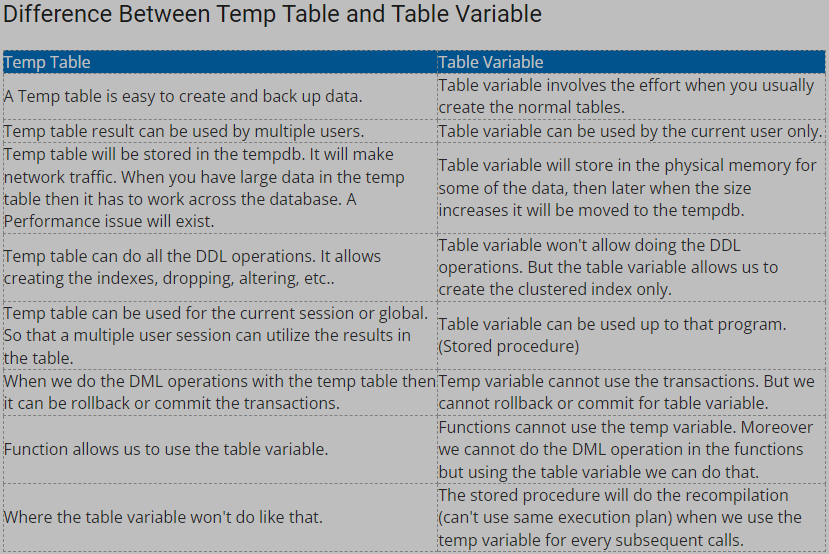

```diff
+ Green
- Red
! Orange
@@ Pink @@
# Gray
```

1. What is index; types of indices; pros and cons

```diff
+ One of the best ways to reduce disk I/O(Input/Output) is to use an index
Used to: 
    - Quickly find data in the WHERE clause.
    - Find matching rows in JOIN clause
    - Maintain quniqueness of key columns during INSERT & UPDATE
    - Sort, Aggregate and Group data. 

@@ Clustered Index && Non-Clustered Index @@
! Clustered Index: 
    - a way to represented base data as a whole.
        - Data rows are sorted
        - Data is stored at the leaf level
    - Primary key as default
- CON
    - Can't use filter, bacause it contains the base data in the table.
    - A clustered index creates lots of constant page splits, which includes data page as well as index pages.
- PRO
    - An ideal option for range or group by with MAX, MIN, COUNT type Queries

! Non-Clustered Index: 
    - a physically separate structure that reference the base data and it can have different sorted order.
        - Data rows are not sorted (Because it doesn't change the base data)
        - INCLUDE stored at leaf level
    - Uses Cluster ket or RID of a heap.
- CON
    - Have to use INCLUDE clause to get non-key value
    - Lookup process becomes costly
    - Every time the clustering key is updated, a corresponding update is required on the non-clustered index as it stores the clustering key.

- PRO
    - A table may have multiple non-clustered indexed in RDBMS.

Disadvantage of Index: 
    - Additional Disk Space
    - Insert, Update, Delete Statement become slow 
```

2. What's the difference between Primary key and Unique constraint?
```diff
! Primary Key:
    - Unqiue field on table, can't be null.
    - Other table can use this field to create foreign key relationships to themselves.
    - Create the cluster index automatically.
    - Only 1 primary key in a table.

! Unique Contraint:
    - A particular field must be unique.
    - Allows multiple Unqiue contraint in a table.
```

3. Tell me about check constraint
- Used to Limit the value range that can be placed in a column.
```
--Example:
    CREATE TABLE Persons (
    ID int NOT NULL,
    LastName varchar(255) NOT NULL,
    FirstName varchar(255),
    Age int,
    CHECK (Age>=18));
```

4. Difference between temp table and table variable
Temporary Tables (#tmp) and Table Variables (@tmp)

```diff
! Temporary table
    a database table that exists temporarily on the database server.
    - stores a subset of data from a normal table for a certain period of time.

Used it when you have a large number of records in a table and you repeatedly need to interact with a small subset of those records.

! Table Variable
    a special type of the local variable that helps to store data temporarily. 
    - don't participate in transactions. If you want to ROLLBACK mid way through a procedure then table variables will still be populated.
```



5. Difference between WHERE and HAVING

```diff
! WHERE
is used to filter the records from the table or used while joining more than one table.
    - used with select update
    - used before group by clasue

SELECT S_Name, Age FROM Student 
WHERE Age >=18

! HAVING
is used to filter the records from the groups based on the given condition in the HAVING clause.
    - Have to have group by.
    - can contain aggregate function
    - only used with select
    - used after group by

SELECT Age, COUNT(Roll_No) AS No_of_Students 
FROM Student 
GROUP BY Age
HAVING COUNT(Roll_No) > 1 

```

6. Difference between RANK() and DenseRank() — value gap

```diff
! Rank:
    - Ties are assigned the same rank, with the next ranking skipped. (1,2,2,4)

! Dense_Rank:
    - rank within your ordered partition, but ranks are consecutive. (1,2,2,3)
```

7. COUNT(*) vs. COUNT(colName)
```diff
! Count(*)
    - returns all rows whether column contains null value.

! Count(columnName)
    - returns the number of rows except null rows.
```


8. What's the difference between left join and inner join? JOIN and Subquery, which one has a better performance, why?

```diff
! Left join:
    - Returns all records from the left table, and the matched records from the right table, If no matched data from right table, that rows will have NULL values. 

! Inner join:
    - Returns records that have matching values in both tables.

! Join:
    - executes faster. will always faster than subquery
    - Better use database's abilities to search through, filter, sort, etc. Instead of multiple quries using one join query.
-    Disadvantages:
    - not easy to read as subquery
    - incorrect joins can result in serious performance degradation and inaccurate query results.

!Subquery:
    - easy to understand. 
-    Disadvantages: 
    - we cannot modify a table and select from the same table within a subquery in the same SQL statement.

!Conclusion:
A subquery is easier to write, but a joint might be better optimized by the server. For example a Left Outer join typically works faster because servers optimize it.
```

9. What is correlated subquery

```diff
Evaluated once for each row processed by the parent statement. The parent statement can be Select, update, and delete.

SELECT last_name, salary, department_id
 FROM employees outer
 WHERE salary >
                (SELECT AVG(salary)
                 FROM employees
                 WHERE department_id =
                        outer.department_id);

! Nested Queries (subquery):
    The inner SELECT query runs first and executes once. return Values to be used by the main query.
! Correlated Subqueries:
    Executes once for each candidate row considered by the outher query. Executed after the outer query is executed. outer query is always dependent on inner query.

“It is not recommended to use Correlated Subqueries as it slows down the performance”
```

10. What is a CTE, why do we need CTE?
```diff
! CTE - Common table expression.
    - allows you to define a temporary named result set that availble temporarily in the execution scope of a statement . 

WITH expression_name[(column_name [,...])]
AS
    (CTE_definition)

Advantage:
1. improve code readability
2. provides recursive programming
3. make code maintainability easier
```
11. What does SQL Profiler do?
```diff
It is a tracing tool used to trace activities and operations executed on a specific SQL server databse engine. 
    1. Tracing
    2. Replay.
    For testing the performace of a database.

```
12. What is SQL injection, how to avoid SQL injection?

```diff
SQL injection is a code injection technique that might destroy your database.
SQL injection is one of the most common web hacking techniques.
SQL injection is the placement of malicious code in SQL statements, via web page input.
How To Avoid SQL Injection:
Option 1: Use of Prepared Statements (with Parameterized Queries)

// This should REALLY be validated too
String custname = request.getParameter("customerName");
// Perform input validation to detect attacks
String query = "SELECT account_balance FROM user_data WHERE user_name = ? ";
PreparedStatement pstmt = connection.prepareStatement( query );
pstmt.setString( 1, custname);
ResultSet results = pstmt.executeQuery( );

Option 2: Use of Properly Constructed Stored Procedures

 Try
   Dim command As SqlCommand = new SqlCommand("sp_getAccountBalance", connection)
   command.CommandType = CommandType.StoredProcedure
   command.Parameters.Add(new SqlParameter("@CustomerName", CustomerName.Text))
   Dim reader As SqlDataReader = command.ExecuteReader()
   '...
 Catch se As SqlException
   'error handling
 End Try

Option 3: Allow-list Input Validation

public String someMethod(boolean sortOrder) {
 String SQLquery = "some SQL ... order by Salary " + (sortOrder ? "ASC" : "DESC");`
 ...

Option 4: Escaping All User Supplied Input
```

13. Difference between SP and user defined function? When to use SP when to use function?

<table border="0">
 <tr>
    <td><b style="font-size:15px">Function</b></td>
    <td><b style="font-size:15px">Stored Procedure</b></td>
 </tr>
 <tr>
    <td>Must return a value</td>
    <td>Return value is optional</td>
 </tr>
 <tr>
    <td>Must be a part of an SQL statement to get executed</td>
    <td>Useing EXECUTE or EXEC</td>
 </tr>
  <tr>
    <td>Can only have input parameter</td>
    <td>Input and output parameter</td>
 </tr>
   <tr>
    <td>Can NOT change anything</td>
    <td>Can change database object</td>
 </tr>
  </tr>
   <tr>
    <td>Allows only SELECT statement</td>
    <td>Allows SELECT & DML statements</td>
 </tr>
</table>

14. Criteria of Union and Union all? Difference between UNION and UNION ALL

```diff
Union means joining 2 or more data sets into a single set.
The only difference is that union all including @@ duplicates @@.
```
15. Steps you take to improve SQL Queries

```diff
1. Define the requirements first.
2. Select fields instead of using Select*
3. Avoid using Select Distinct
4. Create joins with inner join
5. Use WHERE instead of HAVING to define filters
6. Use wildcards at the end of a phrase only
7. Use LIMIT to sample query results
8. Run your query during off-peak hours
Source: https://www.sisense.com/blog/8-ways-fine-tune-sql-queries-production-databases/
```

16. concurrency problem in transaction

```diff
    - Temporary Update Problem
    - Incorrect Summary Problem
    - Lost Update Problem
    - Unrepeatable Read Problem
    - Phantom Read Problem
```

Unrepeatable Problem:<br>  Read & (Read after write)


 Phantom Read Problem:<br> Read & (Read after Delete) 


17. what is deadlock, how to prevent

```diff
! DeadLock
A situation where a set of processes are blocked because each process is holding a resource and waiting for anther resource acquired by some other process.

- Prevention:
    - Eliminate Hold and wait -> allocate all required resources to the process before the start of its execution.
    - Elimate No Preemption -> resources from the process when resources required by other high priority processes.
    - Banker's algorithm
        test all the request made by processes for resources, it checks for the safe state, if after granting request system remains in the safe state it allows the request and it there is no safe state it doesn't allow the request made by the process.
```
18. what is normalization, 1NF - BCNF, benefits using normalization
```diff
! Normalization:
is the process to eliminate data redundancy and enhance data integrity in the table. 
Helps to organize the data in the database.

! 1NF: 1st Normal From:
Eliminate Repeating Groups

! 2NF: 
Eliminate Partial Functional Dependency.

! 3NF:
Eliminate Transitive Dependency

! Boyce CoddNormal Form (BCNF)
every functional dependency X-> Y, X is the super key of the table. is a advance version of 3NF.

+ Benefits of normalization:
Higher data security.
Better and quicker execution.
More flexible databse design.
Provides data consistency within the databse.
```
19. what are the system defined databases?

```diff
! master databse: 
Record all the system-level information

! msdb databse
Used by SQL server Agent for scheduling alerts and jobs.

!model databse
Used as the template for all databses created on the instance of SQL server.

!Resource databse
Read-Only databse that contains system object that are included with SQL Server.

!tempdb databse
Hoding temporary objects or intermediate result sets.
```

20. Composite key

Also a Primary Key. But this is made by combination of more than one column to identify the particular row in the database.

21. candidate key

A specific type of field in a relational databse that can identify each unqiue record independently of any other data.

One databse can have multiple candidate key. but only one of these candidate can be primary. 

22. DDL vs. DML

```diff
! DDL -Data Definition Language
Used to descriptions of the databse schema and is used to create and modify the structure of the database objects in the databse. 
CREATE,
DROP, 
ALTER, 
Truncate

! DML -Data Manipulation Language
deals with the manipulation of data present in the database belong to DML. includes most of the SQL statement.
INSERT,
UPDATE,
DELETE,
LOCK.
```

23. ACID property

```diff
! A-> Atomicity
The entire transaction takes place at once or doesn't happen at all
! C-> Consistency
The database must be consistent before and after the transaction
! I-> Isolation
Multiple Transactions occur Independently without interference
! D-> Durability
The changes of a successful transaction occurs even if the system failure occurs.
```
24. table scan vs. index scan
```diff
When SQL server has to scan the data or index pages to find the appropriate records.

! Table Scan
The query starts from the physical beginning of the table and it goes through every row into the table.
    - Generally, a full table scan is used when a query @@ doesn’t have a WHERE clause @@ i.e. all data.

!Index Scan
Used when you have a clustered index and your query needs all or most of the records.
    -Little different from table scan: ->optimizer takes look at the available index and chooses one of the best, based on JOINs and WHERE clauses.

The key difference between Table Scan and Index Scan is that @@data is stored in the index tree@@, the query processor knows it when reaches the end of the current it is looking for. Then it can send the query or move on to the next range of data.
```
25. Difference between Union and JOIN


<table border="0">
 <tr>
    <td><b style="font-size:15px">Join</b></td>
    <td><b style="font-size:15px">Union</b></td>
 </tr>
 <tr>
    <td>combines data from many tables based on a matched condition between them</td>
    <td>SQL combines the result-set of two or more SELECT statements.</td>
 </tr>
 <tr>
    <td>Combines data into new [columns]</td>
    <td>Combines data into new [rows]</td>
 </tr>
  <tr>
    <td>Number of columns selected from each table [may not] be same.</td>
    <td>Number of columns selected from each table [shouble] be same.</td>
 </tr>
  </tr>
   <tr>
    <td>Datatypes of corresponding columns selected from each table can be different.</td>
    <td>Datatypes of corresponding columns selected from each table should be same.</td>
 </tr>
    <tr>
    <td>It may not returns distinct rows.</td>
    <td>It returns distinct rows.</td>
 </tr>
</table>
Source from: https://www.geeksforgeeks.org/difference-between-join-and-union-in-sql/